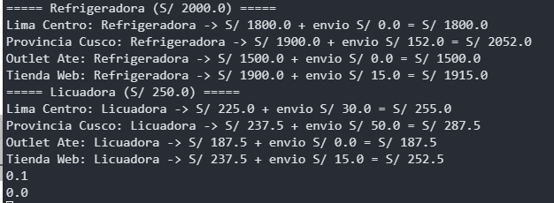
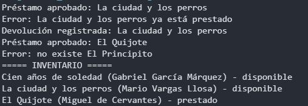
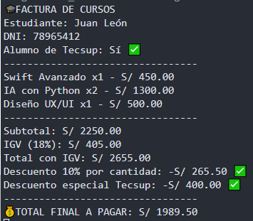
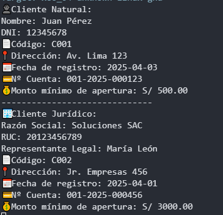
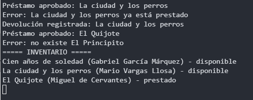

# Laboratorio 04: Programación Orientada a Objetos en Swift

**Alumno:** Pablo Isla Arone  
**Curso:** Programación en Móviles Avanzado  

---

## Rama `manual`

### Caso 1.5: Herencia y Polimorfismo - La Cadena de Sucursales
Se implementó herencia definiendo el flujo de cotización en la clase base `Sucursal` y sobreescribiendo las reglas de envío y descuento en las subclases. El recorrido polimórfico se hizo con un solo `for-in`.

**Evidencia de salida en consola:**

**Respuestas a los FIX y PREDICT:**
* **FIX 7:** Falta `override` porque Swift exige confirmar que estás reemplazando un método de la clase padre.
* **FIX 8:** Falta llamar a `super.init(nombre: nombre, ciudad: ciudad)` para inicializar las variables de la clase padre.
* **PREDICT 6:** Imprime `0.1` porque en tiempo de ejecución Swift usa el método de la clase real instanciada que es `SucursalLima`.
* **PREDICT 7:** Imprime `0.0`.

### Caso 2 Parte A: Biblioteca SIN IA
Se aplicaron structs y clases. Se recorrieron los arreglos por índice `for i in 0..<libros.count` para modificar la propiedad del struct directamente dentro del arreglo.

**Evidencia de salida en consola:**

### Actividad Propuesta 01: Factura de Cursos
Se calculó el descuento por cantidad y el descuento especial de Tecsup basándose en condicionales `if`.

**Evidencia de salida en consola:**

### Actividad Propuesta 02: Cliente Natural y Jurídico
Implementación de herencia simple y sobrescritura del método `MostrarDatos()`.

**Evidencia de salida en consola:**

---

## Rama `ai-assisted`

### Caso 2 Parte B: Biblioteca CON IA
Código generado a través de Gemini con restricciones estrictas de sintaxis, incluyendo comentarios línea por línea generados automáticamente.

**Evidencia de salida en consola:**

**Nota:** La comparación completa entre mi versión y la de IA se encuentra en el archivo `PROMPTS.md`.